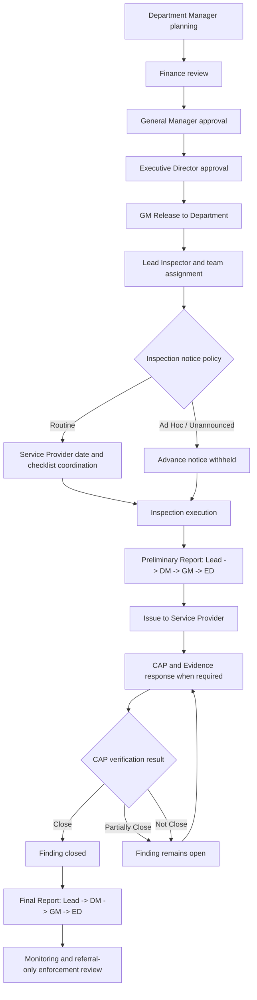

# Master Workflow

## Core loop

Surveillance Plan → Audit / Inspection → Checklist → Finding / Observation → CAP → Evidence → CAA Review → Closure → Dashboard / Report

## Accepted inspection lifecycle

The Preliminary Report approval chain never changes based on whether CAP is
required. Executive Director approval releases the report to the matching
Service Provider organization. `capRequired` determines only whether the
recipient must respond with CAP and Evidence or can simply view the report.

## Audit lifecycle

1. Draft
2. Planned
3. Scheduled
4. In Progress
5. Checklist Completed
6. Draft Report
7. Report Issued
8. Follow-up Open
9. Closed
10. Cancelled

## Finding lifecycle

1. Draft Finding
2. Finding Issued
3. Waiting for CAP
4. CAP Submitted
5. CAP Accepted or Returned
6. Evidence Required
7. Evidence Submitted
8. CAP verification: Close, Partially Close, or Not Close
9. Closed only for Close; otherwise More Information Requested
10. Authorized closure, when separately permitted and reasoned
11. Referral for separate authorized enforcement review, if required

## Hard rule

CAP acceptance does not close the Finding. `Close` records successful
verification and closes it. `Partially Close` and `Not Close` keep it open and
require further action or Evidence. Authorized closure is a separate,
reason-required path and does not create a CAP verification result.

## Owner model

Every record must have one current owner:

- CAA Inspector
- Lead Inspector
- Department Manager
- General Manager
- Executive Director
- Service Provider / Auditee
- Authorized enforcement reviewer, after referral

## Next action model

Every record must show the next action:

- Start inspection
- Complete checklist
- Issue finding
- Submit CAP
- Review CAP
- Upload evidence
- Review evidence
- Record Close, Partially Close, or Not Close
- Provide remaining action or Evidence
- Refer for separate enforcement review

## Blocking rules

A Finding cannot close if required CAP is not accepted, required Evidence is
not submitted and verified, mandatory decision comments are missing, or the
actor lacks closure authority. Preliminary and Final Report approval never
closes a Finding. Enforcement is recommendation/referral only and cannot apply
a sanction automatically.

## Demo boundaries

- Browser-local mock approvals with demo timestamps.
- Demo audit history for traceability; not a production audit trail.
- Mock filenames and local browser state; no secure document storage.
