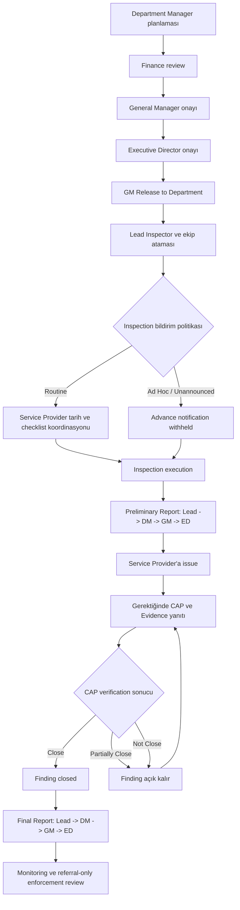

# Ana Workflow

## Core loop

Surveillance Plan → Audit / Inspection → Checklist → Finding / Observation → CAP → Evidence → CAA Review → Closure → Dashboard / Report

## Kabul edilen inspection lifecycle

Preliminary Report approval zinciri CAP gereksinimine göre değişmez. Executive
Director approval, raporu eşleşen Service Provider kuruluşuna release eder.
`capRequired` yalnız alıcının CAP ve Evidence ile yanıt vermesi ya da raporu
sadece görüntülemesi gerektiğini belirler.

## Audit lifecycle

1. Draft
2. Planned
3. Scheduled
4. In Progress
5. Checklist Completed
6. Draft Report
7. Report Issued
8. Follow-up Open
9. Closed
10. Cancelled

## Finding lifecycle

1. Draft Finding
2. Finding Issued
3. Waiting for CAP
4. CAP Submitted
5. CAP Accepted or Returned
6. Evidence Required
7. Evidence Submitted
8. CAP verification: Close, Partially Close veya Not Close
9. Yalnız Close ile Closed; diğer sonuçlarda More Information Requested
10. Ayrı yetkilendirilmişse authorized closure
11. Gerekirse ayrı authorized enforcement review'a referral

## Sert kural

CAP acceptance Finding'i kapatmaz. `Close` başarılı verification kaydeder ve
Finding'i kapatır. `Partially Close` ile `Not Close` Finding'i açık tutar ve ek
aksiyon veya Evidence gerektirir. Authorized closure ayrı ve reason-required
bir yoldur; CAP verification sonucu üretmez.

## Owner modeli

Her kaydın bir current owner'ı olmalı:

- CAA Inspector
- Lead Inspector
- Department Manager
- General Manager
- Executive Director
- Service Provider / Auditee
- Referral sonrasında authorized enforcement reviewer

## Next action modeli

Her kayıt next action göstermeli:

- Start inspection
- Complete checklist
- Issue finding
- Submit CAP
- Review CAP
- Upload evidence
- Review evidence
- Close, Partially Close veya Not Close kaydetme
- Kalan aksiyon veya Evidence sağlama
- Ayrı enforcement review'a referral

## Blocking rules

Required CAP accepted değilse, required Evidence submit ve verify edilmemişse,
zorunlu decision comment'leri eksikse veya actor closure authority'ye sahip
değilse Finding kapanamaz. Preliminary ve Final Report approval Finding'i
kapatmaz. Enforcement yalnız recommendation/referral'dır ve otomatik sanction
uygulayamaz.

## Demo sınırları

- Demo timestamp'leriyle browser-local mock approval kayıtları.
- Traceability için demo audit history; production audit trail değildir.
- Mock filename ve local browser state; secure document storage yoktur.
